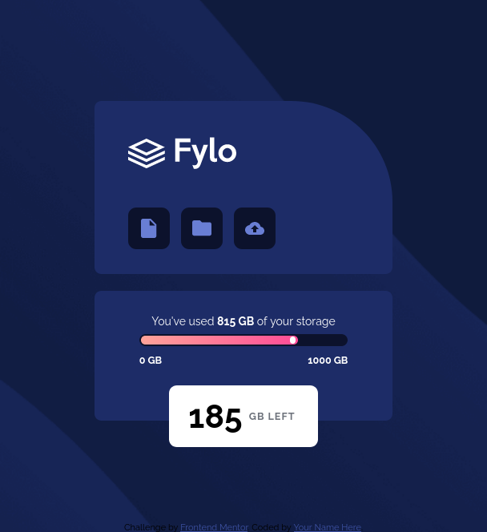

# Frontend Mentor - Fylo data storage component solution

This is a solution to the [Fylo data storage component challenge on Frontend Mentor](https://www.frontendmentor.io/challenges/fylo-data-storage-component-1dZPRbV5n). Frontend Mentor challenges help you improve your coding skills by building realistic projects. 

## Table of contents

- [Overview](#overview)
  - [The challenge](#the-challenge)
  - [Screenshot](#screenshot)
  - [Links](#links)
- [My process](#my-process)
  - [Built with](#built-with)
  - [What I learned](#what-i-learned)
  - [Continued development](#continued-development)
  - [Useful resources](#useful-resources)
- [Author](#author)
- [Acknowledgments](#acknowledgments)

**Note: Delete this note and update the table of contents based on what sections you keep.**

## Overview
Create a data storge component that matches a set desktop and mobile design.

### The challenge

Users should be able to:

- View the optimal layout for the site depending on their device's screen size

### Screenshot





### Links

- Solution URL: [Add solution URL here](https://your-solution-url.com)
- Live Site URL: [Add live site URL here](https://your-live-site-url.com)


### Built with

- Semantic HTML5 markup
- CSS custom properties
- Flexbox
- Mobile-first workflow
- Emmet 

### What I learned

Working through this challenge was a lot of fun. It dealt a lot with creating
layout using CSS. This was something that I knew was possible but never tried it
myself. Learning how to make the triangle piece for the GB left box was also very
interesting.

```
.tri {
  /////
  height: 0px;
  width: 0px;
  border-top: 30px solid transparent;
  border-bottom: 30px solid transparent;
  border-right: 30px solid var(--neut-400);
}
```

### Useful resources

- [W3schools](https://www.w3schools.com/cssref/default.asp) - References of CSS properties and examples.
- [Markdown Guide](http://www.markdownguide.org/cheat-sheet) - Tables of Markdown syntax used for this README.
- [MDN Web Docs](https://developer.mozilla.org/en-US/docs/Web/css) - References of CSS properties and examples.
- [CSS triangle](https://css-tricks.com/snippets/css/css-triangle/#aa-examples) - Tutorial of making CSS Triangles
- [CSS Layers](https://www.tutorialspoint.com/css/css_layers.htm) - Tutorial for making CSS Layers

## Author

- Website - [Kevin Mullen](kevinmullen.net)
- Frontend Mentor - [@Kmullen444](https://www.frontendmentor.io/profile/Kmullen444)

